# Smart City Automation using Cisco Packet Tracer

> **An IIoT-based Smart City Automation System developed using Cisco Packet Tracer as part of the L&T EduTech Certificate in Industrial Internet of Things (IIoT). The project demonstrates intelligent street lighting and smart surveillance using wireless IoT devices, a Home Gateway, and rule-based automation to improve energy efficiency and public safety.**

---

## 📖 Project Overview

This project presents a **Smart City Automation System** developed using **Cisco Packet Tracer** during the **L&T EduTech Certificate in Industrial Internet of Things (IIoT)**.

The system integrates wireless IoT devices through a **Home Gateway** to automate street lighting and surveillance. Street lights operate based on **solar intensity** and **motion detection**, while a webcam and siren are automatically activated whenever motion is detected in the surveillance zone.

The project demonstrates the practical implementation of **Industrial Internet of Things (IIoT)** concepts, centralized device management, and rule-based automation for smart city applications.

---

## 🎯 Objectives

* Design and simulate a Smart City Automation System using Cisco Packet Tracer.
* Implement intelligent street lighting using solar intensity and motion detection.
* Develop a smart surveillance system using IoT devices.
* Demonstrate wireless communication through a Home Gateway.
* Showcase rule-based automation for energy-efficient smart city applications.

---

## 🛠 Components Used

* Home Gateway
* Solar Panel
* Motion Detector (Street Lighting)
* Motion Detector (Surveillance)
* Smart Street Lights (3)
* Webcam
* Siren
* Laptop
* IoT Car

### Components Used

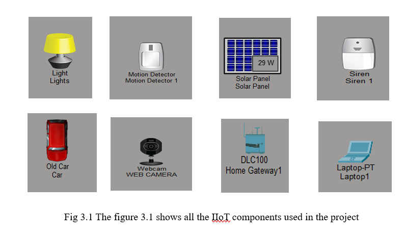

---

## 🏗 System Overview

The **Home Gateway** serves as the central controller of the Smart City network. All IoT devices communicate wirelessly with the gateway. The Solar Panel continuously monitors environmental light intensity, while two Motion Detectors independently monitor the street lighting and surveillance zones.

Based on predefined automation rules, the Home Gateway automatically controls the street lights, webcam, and siren, creating an intelligent and energy-efficient smart city environment.

### System Overview

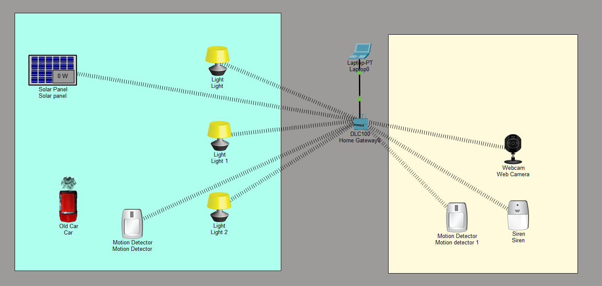

---

## 🔄 System Flowchart

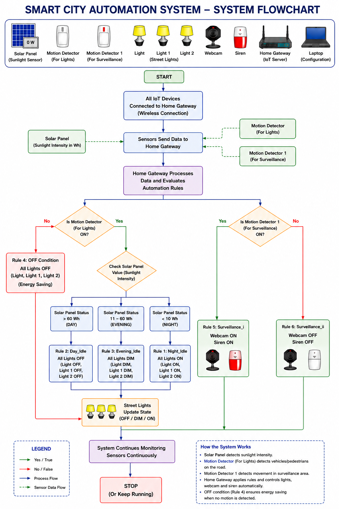

---

## ⚙️ Automation Rules

### 🌙 Rule 1 – Night Mode

**Condition**

* Solar Panel ≤ 10 Wh
* Motion Detected

**Action**

* All street lights turn **ON**.

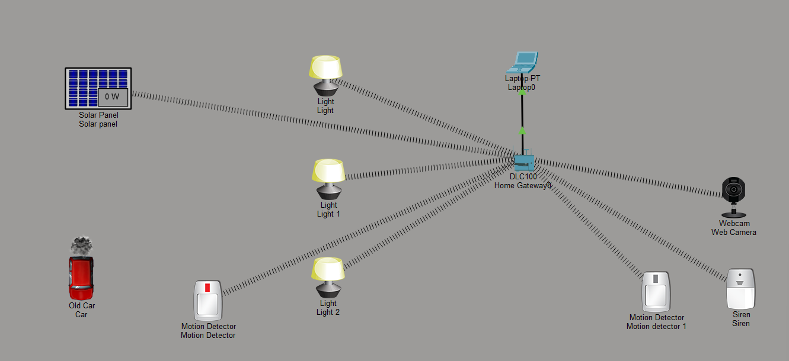

---

### ☀️ Rule 2 – Day Mode

**Condition**

* Solar Panel > 60 Wh
* Motion Detected

**Action**

* Street lights remain **OFF**.
* One street light is intentionally kept in **DIM mode** for demonstration.

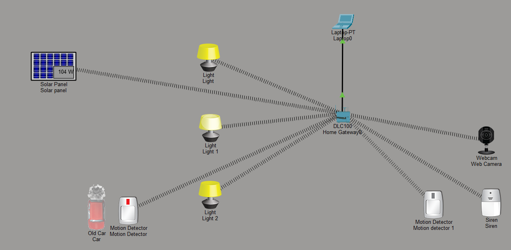

---

### 🌆 Rule 3 – Evening Mode

**Condition**

* Solar Panel between **11 Wh and 60 Wh**
* Motion Detected

**Action**

* All street lights operate in **DIM mode**.

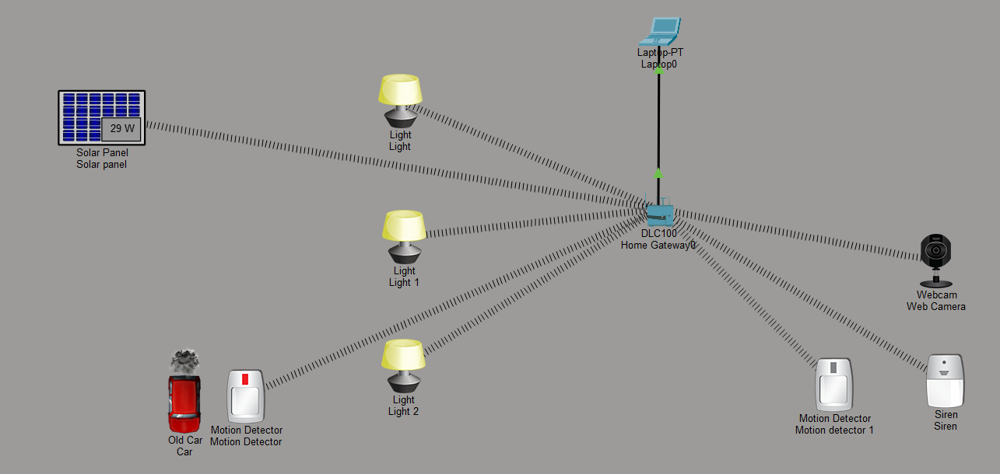

---

### 🚫 Rule 4 – No Motion Detected

When no vehicle or pedestrian is detected, all street lights are automatically switched **OFF** to reduce unnecessary energy consumption.

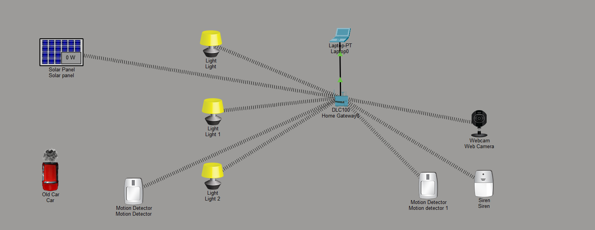

---

### 🚨 Rule 5 – Surveillance ON

**Condition**

* Motion detected in the surveillance zone.

**Action**

* Webcam → **ON**
* Siren → **ON**

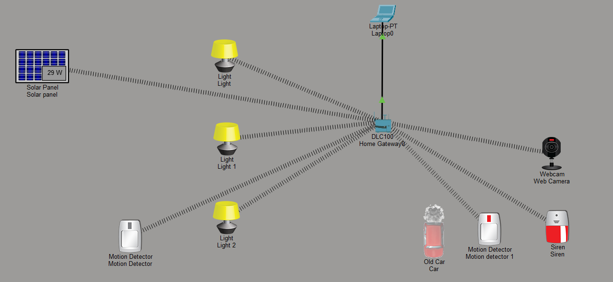

---

### ✅ Rule 6 – Surveillance OFF

**Condition**

* No motion detected.

**Action**

* Webcam → **OFF**
* Siren → **OFF**

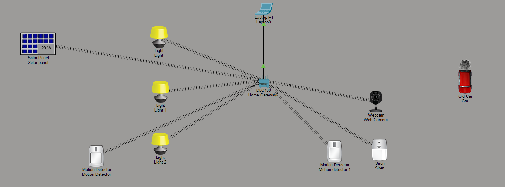

---

## 🔀 Combined Simulation

The following output demonstrates the simultaneous execution of the street lighting and surveillance systems.

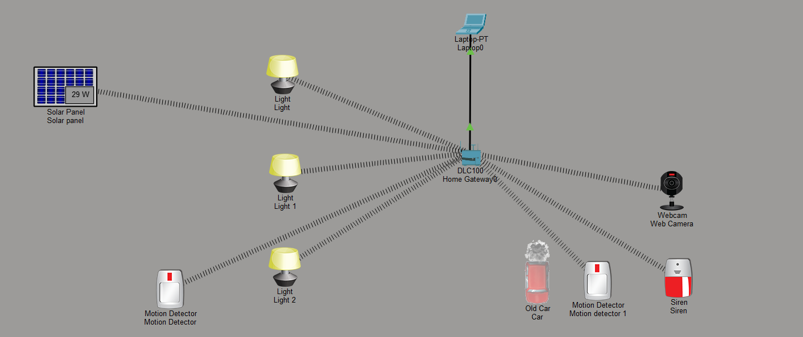

---

## 📋 Automation Rule Configuration

The configured automation rules inside the Home Gateway.

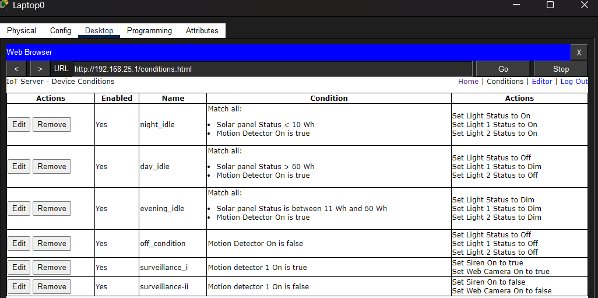

---

## ▶️ How to Run

1. Open **Smart_City_Automation.pkt** in Cisco Packet Tracer.
2. Switch to **Simulation Mode**.
3. Adjust the Solar Panel value to simulate **Day**, **Evening**, and **Night** conditions.
4. Trigger the Motion Detectors.
5. Observe the automatic operation of the street lights, webcam, and siren.

---

## 📁 Repository Structure

```text
Smart-City-IIoT-Project
│
├── README.md
│
├── Screenshots
│   ├── Components_Used.png
│   ├── System_Overview.png
│   ├── Flowchart.png
│   ├── Conditional_Rules.png
│   ├── Night_Mode.png
│   ├── Day_Mode.png
│   ├── Evening_Mode.png
│   ├── No_Movement_Lights_OFF.png
│   ├── Surveillance_ON.png
│   ├── Surveillance_OFF.png
│   └── Combined_Condition.png
│
└── Smart_City_IIoT
    ├── Smart_City_Automation.pkt
    └── Lakshya_Bhardwaj_AIIoT_VIT_Project.pdf
```

---

## 📂 Project Files

📄 **Project Report**

[Lakshya_Bhardwaj_AIIoT_VIT_Project.pdf](Smart_City_IIoT/Lakshya_Bhardwaj_AIIoT_VIT_Project.pdf)

---

### 💻 Cisco Packet Tracer Simulation

The complete Smart City Automation simulation can be downloaded below.

💻 **Packet Tracer Project:**  
[smartcity.pkt](Smart_City_IIoT/smartcity.pkt)

> **Note:** GitHub does not support previewing Cisco Packet Tracer (.pkt) files. Download the file and open it using Cisco Packet Tracer.

---

## 🎥 Project Demonstration Video

The complete simulation and working demonstration of the Smart City Automation System is available on Google Drive.

🔗 **Google Drive:**
https://drive.google.com/file/d/1KOVyEG64guYxyH4xlFersoaL_sMk4MLm/view?usp=sharing

---

## 💻 Software and Simulation Environment

* **Cisco Packet Tracer**

  * Industrial Internet of Things (IIoT) Device Library
  * Home Gateway
  * Laptop Web Browser (IoT Device Configuration and Monitoring)
  * Rule-Based Automation Engine
  * Wireless IoT Communication

---

## 📚 References

* Cisco Networking Academy – Cisco Packet Tracer
* Cisco Networking Academy – Introduction to IoT
* Smart City using IoT Simulation Design in Cisco Packet Tracer (IJRASET)
* A Simulation-Based Smart City Architecture Using Arduino and Cisco Packet Tracer
* Smart City: Recent Advances in Intelligent Street Lighting Systems Based on IoT

---

## 👨‍💻 Author

**Lakshya Bhardwaj**

* **Degree:** B.Tech in Electronics and Communication Engineering
* **University:** VIT Bhopal University
* **Internship Course:** L&T EduTech – Certificate in Industrial Internet of Things (IIoT)

---

## 🙏 Acknowledgement

This project was developed as part of the **L&T EduTech Certificate in Industrial Internet of Things (IIoT)**. It demonstrates the implementation of IoT-based smart city automation using Cisco Packet Tracer through wireless IoT devices, centralized Home Gateway control, and rule-based automation.
